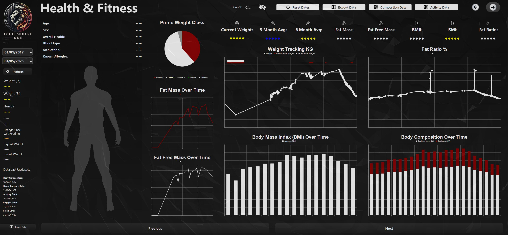

# PyQt6 Health Metrics Dashboard

> Advanced health and fitness metrics dashboard with OpenGL visualization and date range filtering.

[](https://www.python.org/)
[](https://www.riverbankcomputing.com/software/pyqt/)
[](https://www.opengl.org/)

---

## Overview

The PyQt6 Health Metrics Dashboard is a comprehensive desktop application for monitoring and visualizing personal health and fitness metrics. Built with PyQt6 and featuring OpenGL-based 3D visualizations, this dashboard provides health professionals and fitness enthusiasts with powerful tools to track wellness data over time.

The application combines traditional 2D charts with advanced 3D visualizations, offering intuitive data exploration capabilities. With date range filtering and real-time metric calculations, users can analyze health trends, identify patterns, and make data-driven decisions about their wellness goals.

---

## Features

- Import and visualize health metrics data
- Advanced date range filtering and data slicing
- OpenGL-based 3D health visualizations
- Real-time metric calculations
- Multiple visualization types (charts, graphs, 3D views)
- Professional dark-themed UI
- Data trend analysis capabilities
- Responsive dashboard layout

---

## Screenshots

> Drop screenshots into `screens/` and reference them below.



---

## Getting Started

### Prerequisites

- Python 3.8 or higher
- PyQt6
- PyOpenGL (for 3D visualization)
- NumPy (for numerical operations)

### Installation

```bash
git clone https://github.com/Naadir-Dev-Portfolio/Desktop-PyQt6-health-dashboard.git
cd Desktop-PyQt6-health-dashboard
pip install -r requirements.txt
```

### Run

```bash
python Ui_health.py
```

---

## Tech Stack

- PyQt6 — Modern desktop UI framework
- PyOpenGL — 3D graphics and visualization
- NumPy — Numerical computations
- Python — Core application logic

---

## Related Projects

- [Desktop-Mortgage-overpayment-tracker](https://github.com/Naadir-Dev-Portfolio/Desktop-Mortgage-overpayment-tracker)
- [Desktop-PyQt6-finance-dashboard](https://github.com/Naadir-Dev-Portfolio/Desktop-PyQt6-finance-dashboard)
- [Desktop-youtube-view-stats-dashboard](https://github.com/Naadir-Dev-Portfolio/Desktop-youtube-view-stats-dashboard)
